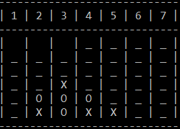

# *Connect4-AI*
*A simple game in C that implements [MiniMax algorithm](https://en.wikipedia.org/wiki/Minimax) with [Alpha-Beta pruning](https://en.wikipedia.org/wiki/Alpha%E2%80%93beta_pruning) optimization.*
<p align="center">
  
</p>

## *Usage information*
- Compile connect4.c
    ```
    $ gcc connect4.c -o connect4
    ```
 - Launch the binary
    ```
    $ ./connect4
    ```
